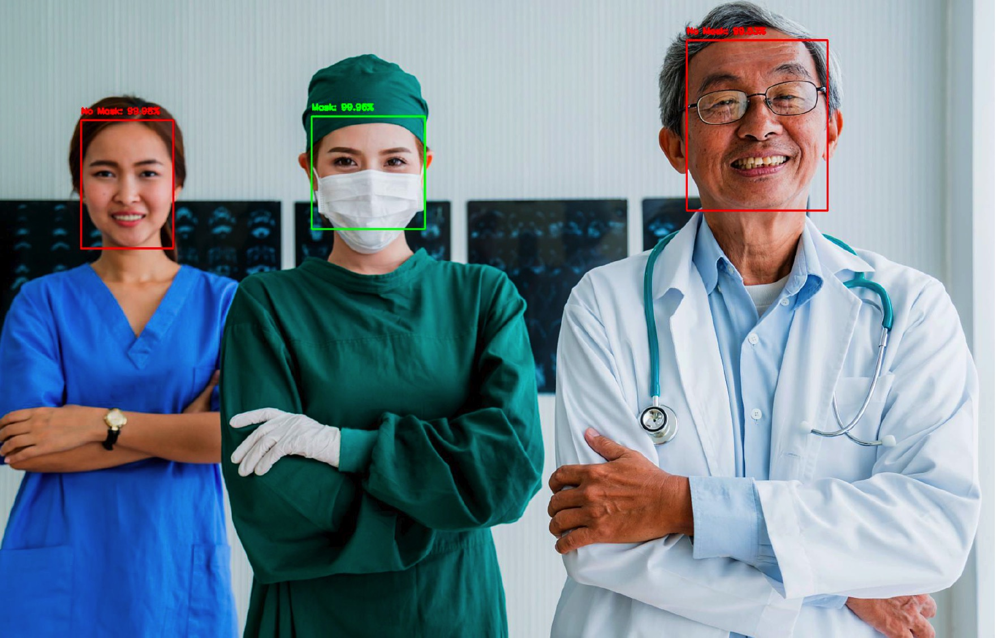

# Face Mask Detection Project
- This is a CV project I learned in DL courses.

### Techniques 
- MobileNetV2 (CNN)
- VGG (Transfer Learning)
- OpenCV
- TensorFlow
- Scikit-Learn

### Identification result overview

### References 
Sandler, Mark, et al. “MobileNetV2: Inverted Residuals and Linear Bottlenecks.” 2018 IEEE/CVF Conference on Computer Vision and Pattern Recognition, 2018, doi:10.1109/cvpr.2018.00474.